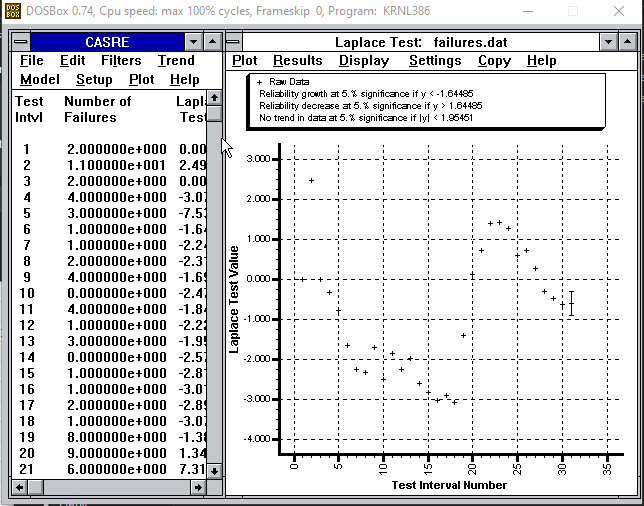
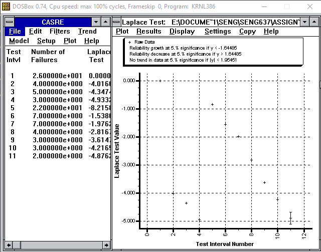
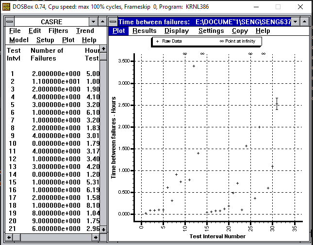
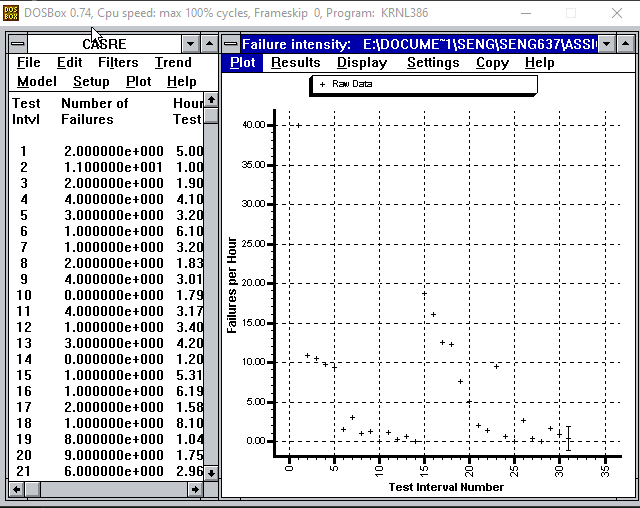
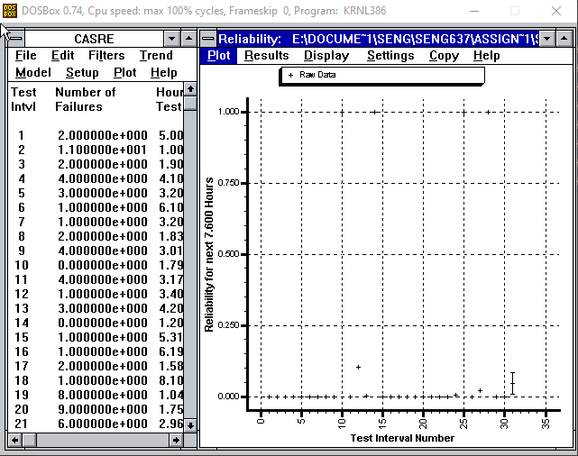
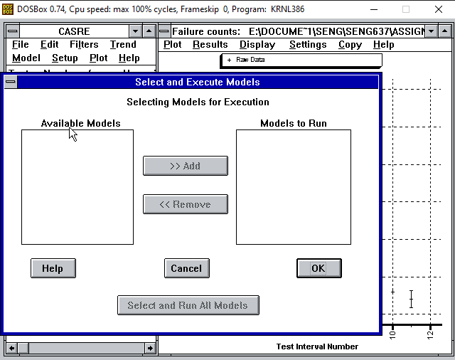
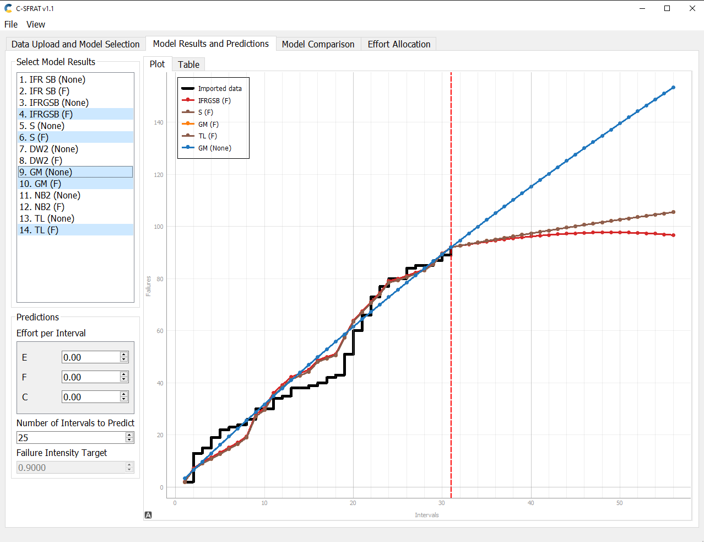
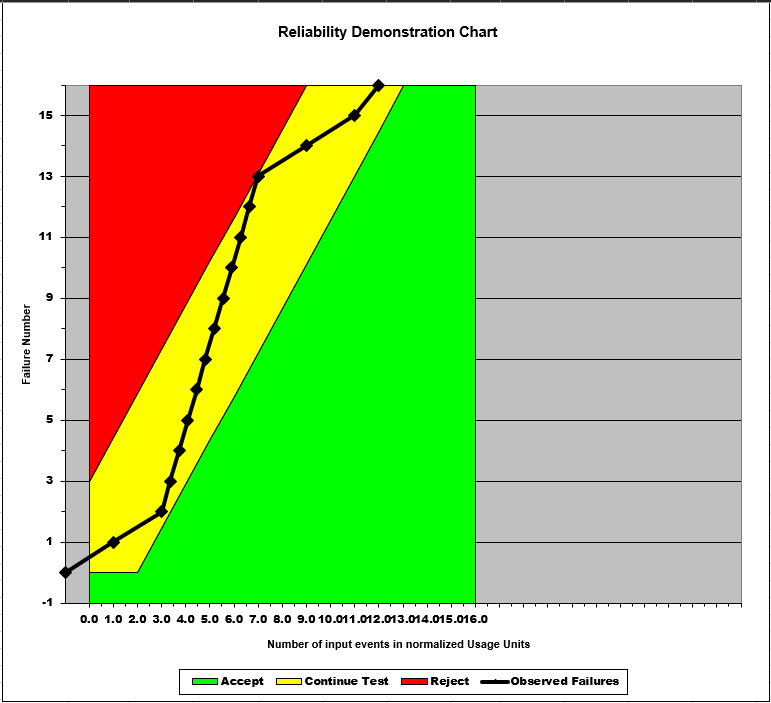
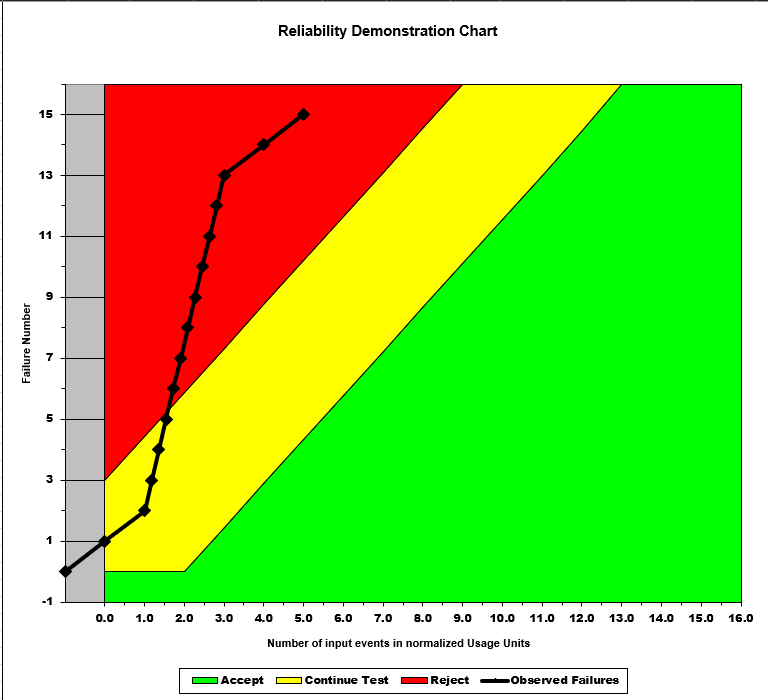
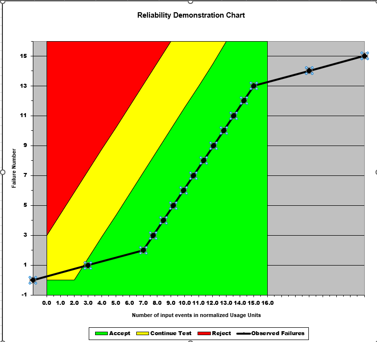

**SENG 637- Dependability and Reliability of Software Systems***

**Lab. Report \#5 – Software Reliability Assessment**

| Group \#:       |
|-----------------|
| Student Names:  |
| Christopher Proc| 
| Sean Buchanan|
| Chris Brunet| 
# Introduction

The goal of this lab is to assess a theoretical System Under Test (SUT) by analyzing its failure data using two techniques, Reliability Growth Testing, and Reliability Demonstration Chart.

# Assessment Using Reliability Growth Testing 

### Tool Choice
For reliability Growth Testing, we ended up using CASRE to analyze the failure data. Of all of the tools that we attempted to use, it was the only one which we were able to make work (with great difficulty, given the poor documentation). CASRE required us to install DOSBOX, install and run it in compatibility mode for Windows 3.0. We ended up converting the failure data into a .DAT file using the format included in the CASRE documentation, and it is included in the github repository as Failures.DAT

The SRTAT tool that was included in the assignment was able to run after considerable troubleshooting of the java classpath, but when we attempted to use the software on the failure data, most of the models threw internal java errors and/or crashed the program. It also failed to include any usable documentation for setting up the data input files necessary to run them.

C-SFRAT ended up being the only working solution out of the available tools in order to run and compare different models, as it was developed in a modern programming language, and the codebase has been maintained and supported. 

### Trend Analysis and Model Selection

Using CASRE, we wanted to conduct trend analysis to determine if the SUT was exhibiting reliability growth. 

CASRE's criteria for reliability growth with a 5% significance is a y value less than ~-1.65
CASRE's criteria for reliability decrease with a 5% significance is a y value greater than ~1.65
CASRE considers there to be no trend in the data if |y| is less than 1.95.

We ran the original data through the Laplace test. 

From inspection of the above chart, we can see that our SUT shows:

| Interval | Result | 
| ----- | ----- | 
| 0-1| No Trend | 
| 2 | Reliability Decrease | 
| 3-5 | No Trend|
| 6-18 | Reliability Growth | 
| 19-21 | No Trend | 
| 22 - 24 | No Trend - Borderline | 
| 25 - 31 | No Trend | 

Based on the above results, we would choose to exclude intervals 0-3 from our data, and include all other data intervals.

Unfortunately, the data provided in the failure-dataset was in the format of Failure Counts, but did not have equal test intervals. According to the CASRE documentation, this is a REQUIREMENT in order for these two tests to be valid. 

Therefore, we had to combine the test data into intervals of roughly equal time, in order to re-run the tests in order to be valid. 

The new Laplace test on equal interval data is shown below.

Based on this Laplace test, we would include all of the data points in our models. We then reverted to our original dataset for all further work.

### Graphs

#### Time-Between-Failures

#### Failure Intensity

#### Reliability

At this point, when we tried to run models using CASRE, the program failed to load any models to execute. We could not troubleshoot this issue, so we switched to C-SFRAT for the remainder of the model analysis.

### Best Models

We loaded the full failure dataset into C-SFRAT, including all of the covariate columns, and conducted an analysis with all models and covariates. 

Based on our testing in C-SFRAT, using the criteria of Squared-Sum-of-Errors, we selected the following 5 models as the best:

| Model (Covariate)| SSE | 
| ----- | ----- | 
| IFRGSB (F) | 756.460 |
|S-Distribution (F) | 759.170 |
|Geometric (F) | 759.655 |
|Truncated Logistic (F) | 759.655 |
|Geometric (None) | 917.068 |

Predictions for future failures in 25 intervals based on each of these models are shown in the below image

### RGT Discussion 

We can see that in all of the models chosen based on best fit, the SUT is demonstrating an expected reliability growth, with increasing time between failures. This is a good sign for the overall stability of the SUT. However, without having a more firm criteria for the required failure rates, it is difficult to provide any conclusive recommendation on the suitability of the software. Typically, we would expect a MTTF threshold to be set based on the end requirements of the software, and its desired stability, and potential impacts of any system failures.

Using the predictions of our top 3 models, we get an average ongoing failure rate of 0.6/interval. When we normalize that by the average interval duration, we get a failure rate of 0.3426/hour. This equates to a MTTF of 2.918 hours.

#### Pros
- RGT and the Trend tests allowed us to easily use pre-built statistical tools in order to identify if our system was showing reliability growth, and allowed us to predict future failure rates.

#### Cons
- Predictions highly depend on the choices made in selecting data ranges and models

# Assessment Using Reliability Demonstration Chart 

### Data Manipulation

For this section of the lab report, we used the RDC-11 excel sheet which was provided in the Assignment 5 artifacts.

This sheet does not accept data in the format that we were given. The provided failure data is given in failures per interval, while the RDC sheet needs time between failures. Therefore, we had to estimate the time of failure of our first 16 datapoints by evenly distributing them in the intervals. This is unlikely to be the true distribution of our failures, but was required to continue with the RDC analysis.

### RDC Parameters

We used the default parameters of the RDC risk profile.

| Parameter | Value | 
| ----- | ----- | 
| Discrimination Ratio | 2 | 
| Developer's Risk | .1 | 
| User's Risk | .1|

The RDC tool provided to us is only designed to plot a limited number failure points on the graph. Therefore, we limited our data to the first 24 failures in our data set. This should be acceptable, because the RDC technique is designed for analyzing data with only limited amounts of failure data. 

### Results

By inspection, we manipulated the FIO until we had a the minimum value which would not enter the failure zone. With the formula MTTF = 1/FIO, we can calculate our MTTFmin. For this failure data, we used an FIO of 4 failures / 1 hour, giving us an MTTFmin of 0.25 hours. In this example, the RDC never enters either the accept or reject zones, but stays within the continue zone. This indicates that more failure data is necessary to judge the system.

When we doubled the MTTFmin, we get an MTTF of 0.5 This translates into a failure rate of 2/hour.

We can see that when we double the MTTF requirement, the system almost immediately enters the rejection zone of the plot.

And when we halve the MTTFmin, we get an MTTF of 0.125. This equates to an FIO of 8/hour.

With this MTTF setting, our SUT immediately enters the accept zone and would pass the RDC analysis.

#### Pros

- Easy to understand model, with clear boundaries for acceptable/unacceptable performance

#### Cons

- Requires some trial and error to find the appropriate output values for FIO and MTTFmin - these values may have a margin of error.

# 

# Comparison of Results

It is difficult to directly compare the results of the two different techniques. Both tended to agree that the system was experiencing reliabililty growth.

We cannot compare MTTF values, as our Reliability Growth techniques focused on predicting future failures after the end of our dataset, while our RDC technique focused on plotting and evaluating failures near the start of our testing. 

Both techniques can provide different insights into the software system's reliability and suitability. 

# Discussion on Similarity and Differences of the Two Techniques

#### Similarities

- Both techniques use measured failure data in order to provide insights into the stability and reliability of the SUT, using target parameters like MTTF and FIO.

#### Differences

- RGT focuses on using mathematical models to predict future failures, while RDC tests whether measured failure data satisfies a predetermined failure criteria.

- RGT does not provide an assessment of overall suitability of the SUT, while RDC can provide a concrete answer for a given MTTF parameter.

# How the team work/effort was divided and managed

All testing and modelling activities were conducted as a group. This was required due to the poor state of the tooling, which required significant effort to troubleshoot, research, and explore. RGT and RDC testing and analysis was conducted in-person as a group, in order to discuss and understand the input parameters and the results. Some individual work was completed in order to manipulate the provided data into the different formats required for different tools. 

All group members provided input for the writing and editing the report. 

# Difficulties encountered, challenges overcome, and lessons learned

- Tooling for this lab was incredibly difficult. 
    - CASRE's documentation was not sufficient, given the complex setup requirements. We managed to get it working through DOSBOX eventually, but the Models would never load. 
    - SRTAT was a challenge to get working, as the .jar was not packed with all of the required files, and needed to have external libraries added to the classpath. Once this was accomplished, we needed to figure out how to format the data input files with no documentation. Once we figured this out, the program would run about half the models reliably, and crash on the rest. The RDC tool in SRTAT would only run on a single failure datapoint, and we were unable to troubleshoot it. 
    - C-SFRAT was the easiest tool to use, but did not include any of the trend tools needed for earlier parts of the lab.
    - The RDC excel sheet has extremely poor documentation, and a number of hard-coded values which limited the amount of failure data we could reliably plot without needing to significantly modify the excel sheet. 

- The data given to us was very often in the wrong format for most of the tooling, with the exception of C-SFRAT. This meant that we needed to perform some interpolation in order to get usable data for the various tools, which may or may not affect the accuracy of our testing.

# Comments/feedback on the lab itself

- The tools, documentation, and instruction for this lab are substandard or nonexistent. This lab should not be used in further years unless it is significantly updated or revised. 
